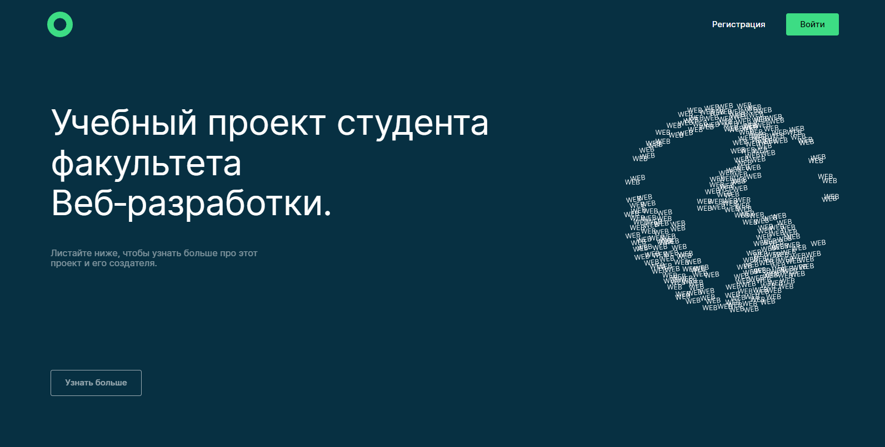

# Дипломная работа (frontend) movies-explorer-api

Это сервис, в котором можно найти фильмы по запросу и сохранить в личном кабинете.

---

## Что было сделанно

- настроена инфраструктура и создан сервер на express
- подключена база данных, созданы схемы и модели ресурсов API
- реализовано логирование, аутентификация и авторизация на сервере
- бэкенд задеплоен на Яндекс Облако
- свёрстаны компоненты на React, разметка портирована в его формат
- описана логика и вёрстка страниц регистрации, логина, редактирования профиля, сохранённых фильмов
- реализованы асинхронные GET- и POST-запросы к API
- проработаны авторизованные и неавторизованные состояния, сохранение фильмов в профиле
- полученные фильмы фильтруются на стороне клиента

---

## Для запуска проекта

1. Склонировать проект на ваш компьютер с [GitHub](https://github.com/Alexey-Melikov/movies-explorer-frontend)
2. Установить зависимости `npm ci`
3. Запустить проект `npm start`

## Ссылки проекта

Проект доступн по [ссылке](https://nemovies.nomoredomains.xyz/).

Исходный код проекта доступен по [ссылке](https://github.com/Alexey-Melikov/movies-explorer-frontend).

Макет проекта можно посмотреть [здесь](https://disk.yandex.ru/d/mbRgT9YMNCOpQg).

API [nomoreparties](https://api.nomoreparties.co/)

MAIN API [nemovies.nomoredomains](https://api.nemovies.nomoredomains.rocks).
